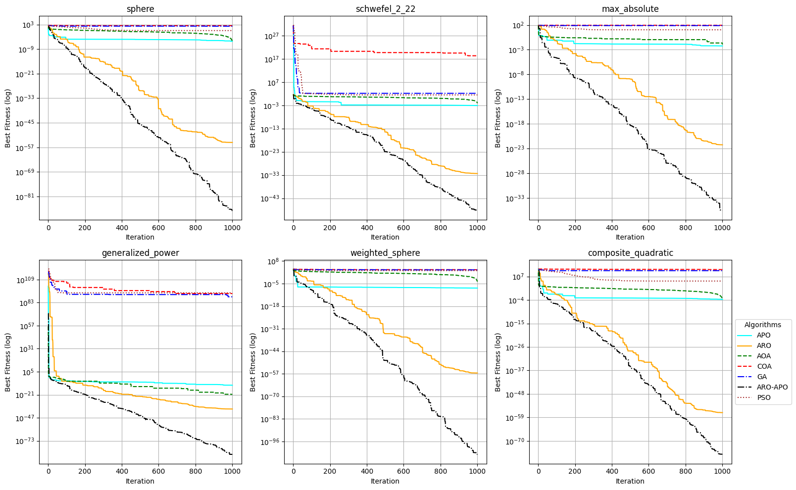

# Metaheuristics Benchmark System (MBS)

<p align="center">
  
  
  
  
</p>

<p align="center">
  <b>Benchmarking and Evaluating Metaheuristic Optimization Algorithms</b>
</p>

---

## 📖 Table of Contents

- [Overview](#-overview)
- [Key Features](#-key-features)
- [Directory Structure](#-directory-structure)
- [Implemented Algorithms](#-implemented-algorithms)
- [Benchmark Functions](#-benchmark-functions)
- [Usage](#-usage)
- [Results](#-results)
- [Contributions](#-contributions)
- [Reproducibility](#-reproducibility)
- [License](#️-license)
- [Contact](#-contact)

---

## Overview

**Metaheuristics Benchmark System (MBS)** is a robust framework for implementing, comparing, and evaluating the performance of popular optimization algorithms (metaheuristics) on standard benchmark functions.

The system focuses on modern optimization techniques such as:
- Artificial Rabbits Optimization (**ARO**)  
- Artificial Protozoa Optimizer (**APO**)  
- Hybrid **ARO-APO**

---

## Key Features

- **Diverse Algorithms**  
  Supports ARO, APO, AOA, COA, GA, PSO, and hybrid ARO-APO  

- **Rich Benchmark Library**  
  Includes standard benchmark functions such as Sphere, Schwefel, Ackley, and more  

- **Automated Analysis**  
  Saves convergence results in `.csv` format for long-term research  

- **Professional Visualization**  
  Generates convergence comparison plots with logarithmic scaling  

---

## Directory Structure

```
SSTT/
├── results/                  # Experimental results
│   ├── apo.csv
│   ├── aro.csv
│   ├── PA1_aoa.csv
│   ├── PA2_coa.csv
│   ├── PA3_ga.csv
│   ├── PA4_aro_apo.csv
│   ├── PA5_pso.csv
│   └── comparison_all.png
├── benchmark.py              # Parameters & objective setup
├── benchmark_func.py         # Benchmark function definitions
├── combine_apo_aro.py        # Optimization algorithms core
└── visualization.py          # Plotting & analysis
```
---
## Implemented Algorithms
| ID  | Algorithm | Full Name                         |
|-----|----------|-----------------------------------|
| APO | APO      | Artic Puffins Optimization     |
| ARO | ARO      | Artificial Rabbits Optimization   |
| PA1 | AOA      | Arithmetic Optimization Algorithm |
| PA2 | COA      | Coati Optimization Algorithm     |
| PA3 | GA       | Genetic Algorithm                 |
| PA4 | ARO-APO  | Hybrid ARO-APO                    |
| PA5 | PSO      | Particle Swarm Optimization       |
---
## Benchmark Functions
- Sphere → Convex, unimodal
- Schwefel 2.22 → Narrow search space evaluation
- Max Absolute → Precision testing
- Generalized Power → Variable gradients
- Weighted Sphere → Dimension-weighted complexity
- Composite Quadratic → High-order complexity
---
## Usage
1. Install dependencies
```
pip install numpy pandas matplotlib scipy
```
2. Run experiments (Can adjust parameters (N, T, dim) in benchmark.py)
```
python combine_apo_aro.py
```

3. Visualize results
```
visualization.py
```
---
## Results
<p align="center">  </p>

## Analysis

- X-axis: Iterations
- Y-axis: Best Fitness (log scale)

The system compares convergence performance across multiple algorithms and benchmark functions.
---
## Contributions
- Unified benchmarking framework for metaheuristics
- Implementation of hybrid ARO-APO algorithm
- Automated evaluation and visualization pipeline
-  Scalable experimental setup for research purposes
---
## Reproducibility
To reproduce results:
```
python combine_apo_aro.py
python visualization.py
```
All outputs are stored in:
```
/results/
```
---
## License
This project is intended for research and educational purposes only.
---
## Contact
- Author: HUIT Research Team
- Email: bachngocvy25112005@gmail.com
